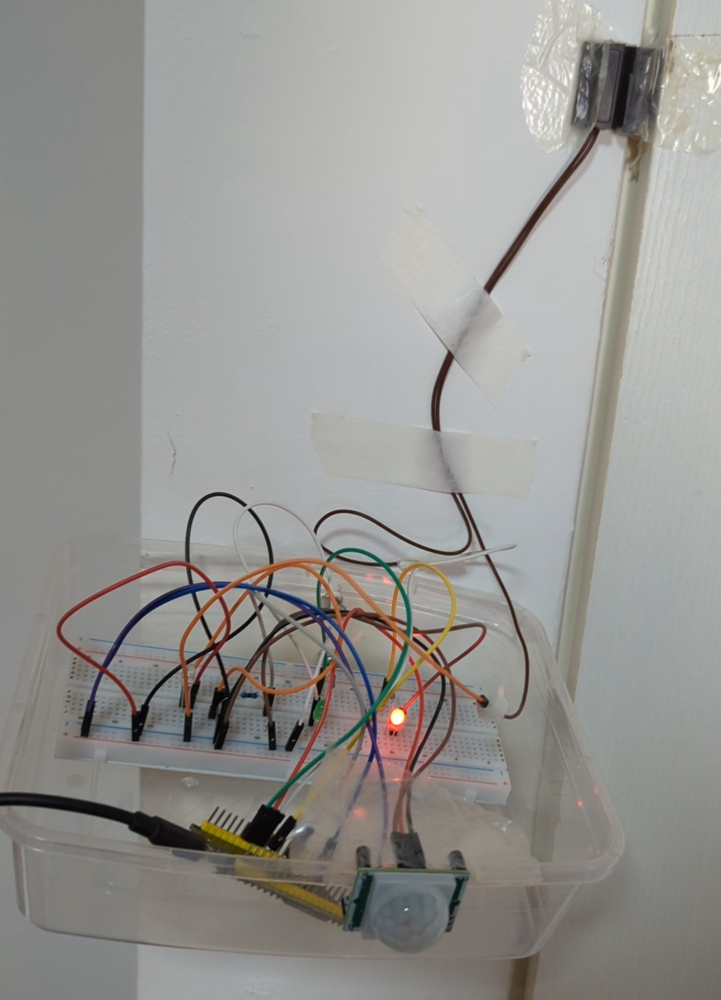

# Automated Room Climate Controller (ESP32, C++)

An embedded system that controls air conditioner operation based on room occupancy.

##  Overview
The system uses:
- **ESP32** microcontroller  
- **PIR motion sensor** for movement detection  
- **MC-38 magnetic door sensor** for door state  
- **IR LED** for transmitting AC remote commands  

When the door opens and no motion is detected after a short delay,  
the ESP32 sends an IR “OFF” command to turn the air conditioner off automatically.  
The system only checks for motion **after a door-opening event** to prevent false AC shutdowns when someone is still in the room.

##  Features
- Embedded control logic for occupancy detection  
- Real-time signal processing and IR communication  
- Context-aware design preventing false triggers  
- Energy-saving automation concept  

##  System Development

### 1️ IR Receiver (Code Capture)
The ESP32 was first programmed to act as an IR receiver to **capture the raw IR shutdown signal** emitted by the original AC remote control.  
The recorded signal was then stored for later transmission.  

File: [`sketch_reciver_ir_final.ino`](./sketch_reciver_ir_final.ino)

### 2️ IR Transmitter (Control Logic)
After obtaining the shutdown code, the ESP32 was configured to **transmit the stored IR sequence** whenever the system detected that the room was unoccupied.  
This step integrates the PIR motion sensor, magnetic door sensor, and timing logic for automated AC control.

File: [`sketch_ac_full_1.ino`](./sketch_ac_full_1.ino)

##  Prototype Build
Below is the functional prototype used for testing.  
Although implemented in a temporary plastic enclosure, it demonstrates complete integration of sensors, logic, and IR control.

*ESP32-based prototype with PIR and magnetic door sensors.*

##  Tools and Technologies
ESP32 · C++ · Arduino IDE · IRremote Library  

---

Developed by **Yuval Sharabi**  
[LinkedIn](https://linkedin.com/in/yuval-sharabi-21b623354)
